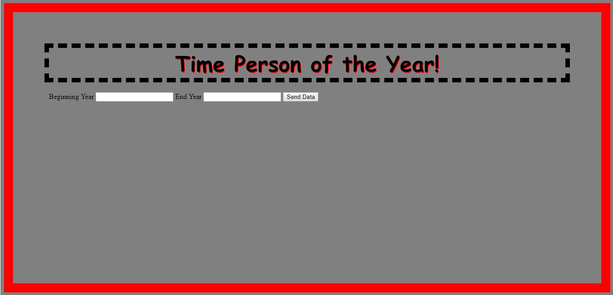
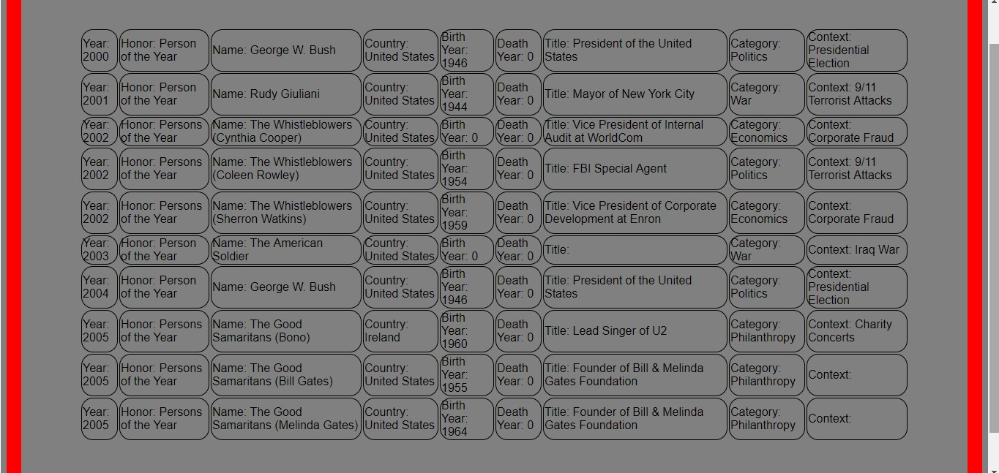

# Lab11-MVCApp

## About this project
This project outputs search results for the time person of the year. The index view is a HTML form that takes inputs from the user for a beginning and ending year. Those inputs are used to parse a list from a csv file. The results are then displayed in a seperate results view. The project relies on MVC architecture, with the controller file processing the input from the user and querying the model to display the appropriate view.

## Example

## How to use
This program requires Visual Studio. Once the repo has been cloned to the user's local machine, they simply need to navigate to the solution folder, and open the solution using Visual Studio. Then, run the program.cs file. After that, follow the prompts. The test file can be opened via the test solution also located in the project directory. The project will open in a browser window, at which point the user enters data into the fields and gets the result.

## Licensing
This program is available under the MIT license.

## Acknowledgements
[jcqnly](https://github.com/jcqnly)
[steph](https://github.com/IndigoShock)